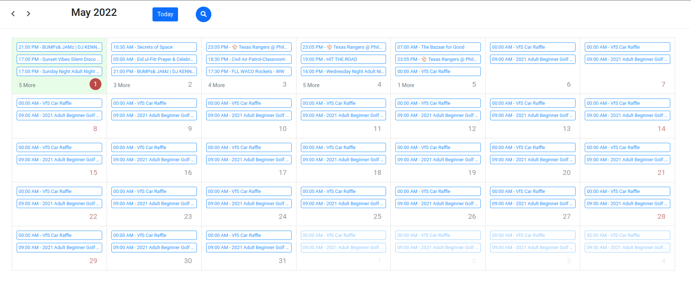
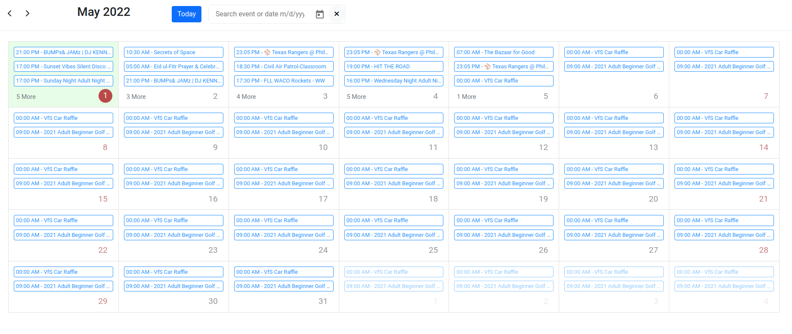

# Time.ly Challenge Test for Frontend Developer

[Challenge PDF](/src/assets/Application%20for%20FrontEnd%20Developer%20Timely.pdf)

## Test Coverage
| Statements                  | Branches                | Functions                 | Lines             |
| --------------------------- | ----------------------- | ------------------------- | ----------------- |
|  |  |  |  |

## link do access deployed app
 - [hosted on vercel](https://time-ly-challenge.vercel.app/)

## Screenshots

## Development server scripts

- Run `ng serve` for a dev server. Navigate to `http://localhost:4200/`. The app will automatically reload if you change any of the source files.

- Run `ng build` to build the project. The build artifacts will be stored in the `dist/` directory. Use the `--prod` flag for a production build.

- Run `ng test` to execute the unit tests via [Karma](https://karma-runner.github.io).
